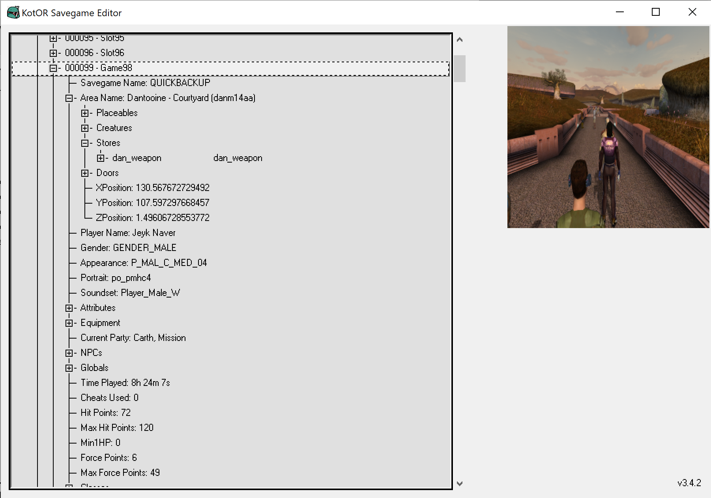

# KotOR Savegame Editor

 
 
[](https://github.com/nadrino/kotor-savegame-editor/releases/)
[](https://GitHub.com/nadrino/kotor-savegame-editor/releases/)

Recompiled with extra functionalities


## Download

- Download the zip file named `KSE_XXX.zip` (when `XXX` is the latest version) in the release section: [link](https://github.com/nadrino/kotor-savegame-editor-reloaded/releases).
- Unzip this file in a folder of your choice.
- Make sure `kse.ini` contains the right paths to your KotOR games. By default those point towards the Steam versions. You can use the embedded [KPF.exe](https://bitbucket.org/kotorsge-team/kpf-gtk/downloads/) to help you set these up.
- Launch `KSE.exe`


## Screenshot




## Build On Windows

- Install perl 5.16.3.1 32bits (portable) http://strawberryperl.com/releases.html
- Unzip the archive in the folder of your cloned repository
- Open Powershell
- Exectue .bat file in the unzipped directory to setup the environement for perl
```bat
\\Path\to\portableshell.bat
pushd \\Path\to\code
```
- Install required dependencies :
```bat
cpan install Tk::HList
cpan install Tk::Autoscroll
cpan install Tk::DynaTabFrame
cpan install Win32::FileOp
cpan -fi PAR::Packer
```
- Compile the perl script :
```bat
pp --gui -o KSE.exe kse.pl
```
- Launch KSE.exe


```shell
.\strawberry-perl-5.32.1.1-32bit-portable\portableshell.bat
cpan # CPAN CLI


get Tk::HList Tk::Autoscroll Tk::DynaTabFrame
get Win32::FileOp
get pp

install Tk::HList Tk::Autoscroll Tk::DynaTabFrame
install Win32::FileOp
force install pp

exit # EXIT CPAN CLI
```


## Contributors Prior to this Repository

- FairStrides
- tk102 - Original KSE author
